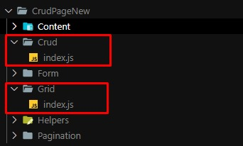
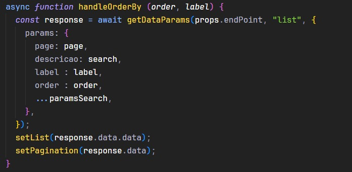

## Criação do OrderBy Dentro Do Rh247

  Vocês vão encontrar um propriedade
  com o nome de <strong>portal</strong>.

 Ela serve para tirar umas coisas de estilização do component para eu conseguir utilizar ele no modulo
 <strong>portal.</strong>

<h2>
 Explicações como fui o component.
</h2>

  A logicá toda está nas seguintes partes : 

<h6>
  O arquivo principal desse <strong>CrudPageNew</strong> é o arquivo <strong>Crud/index.js.</strong>
</h6>

  Dentro do crud existe uma função chamada <strong>handleOrderBy.</strong>

 

  Essa função recebe dois paramêtros o <strong>order</strong> e o <strong>label.</strong>
   
  Passamos no <strong>getDataParams</strong> o seguinte params page, descricao, label, order, ...paramsSearch.

<strong>

</strong>